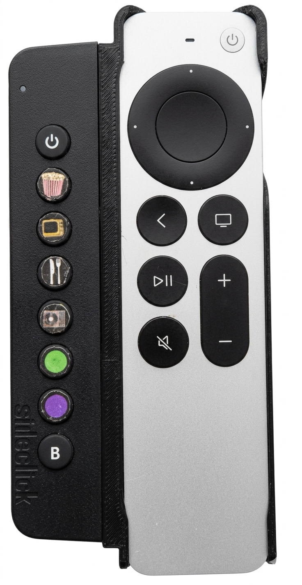
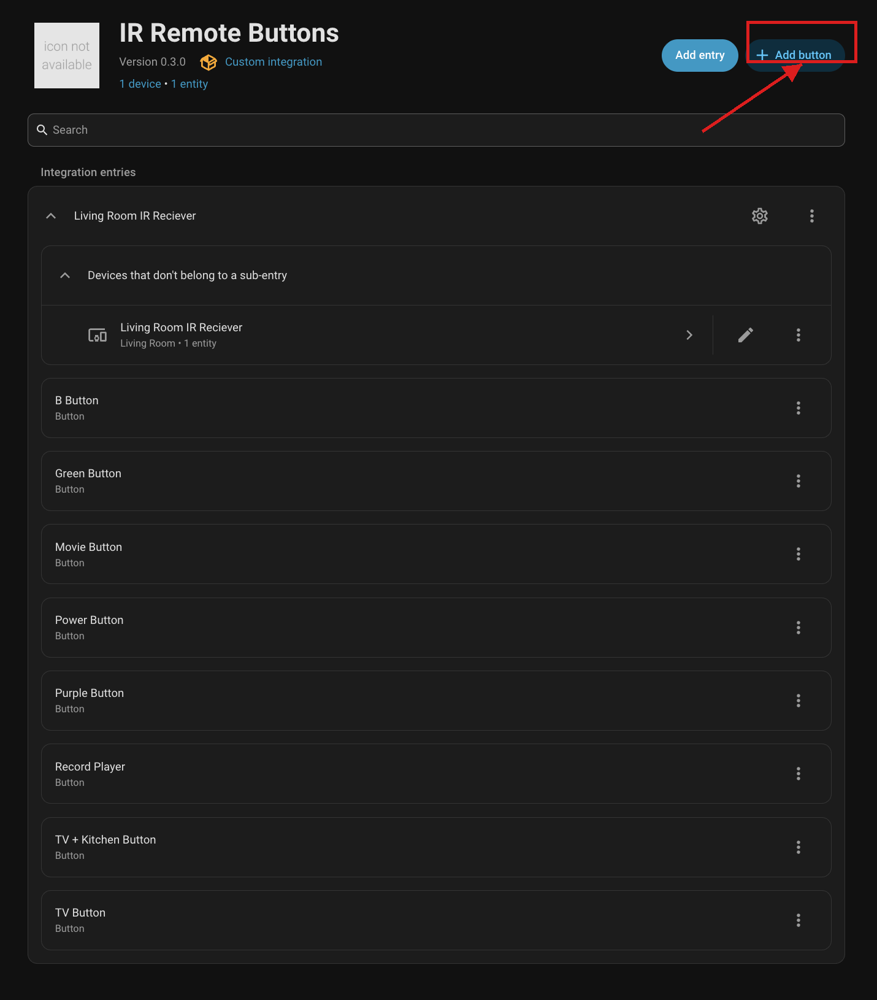
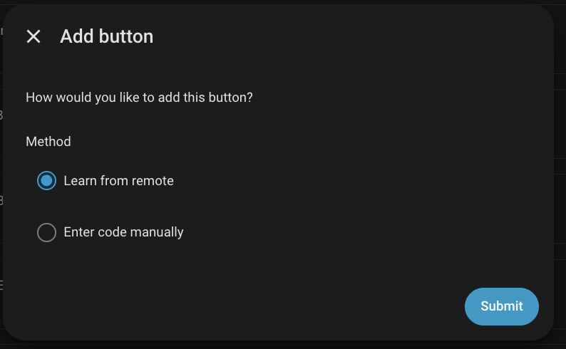
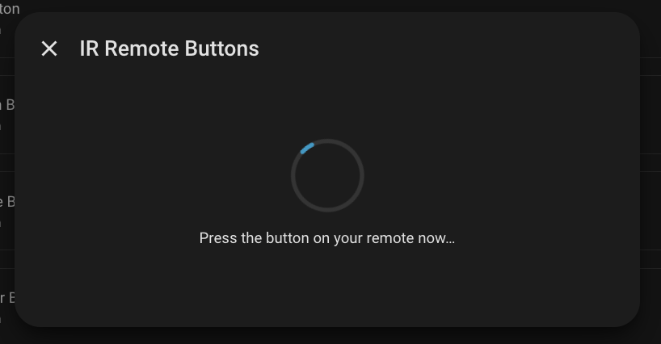
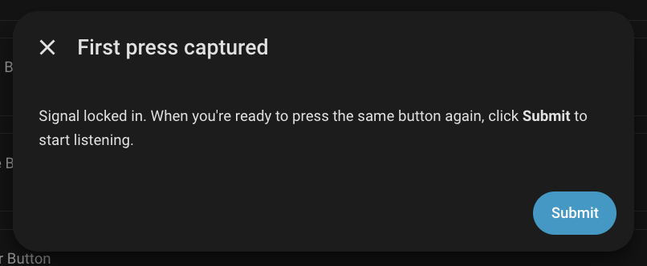
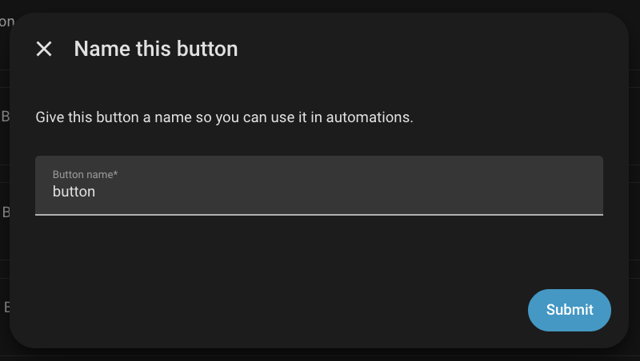
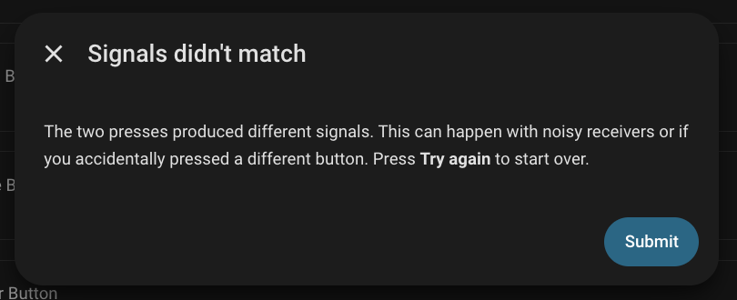
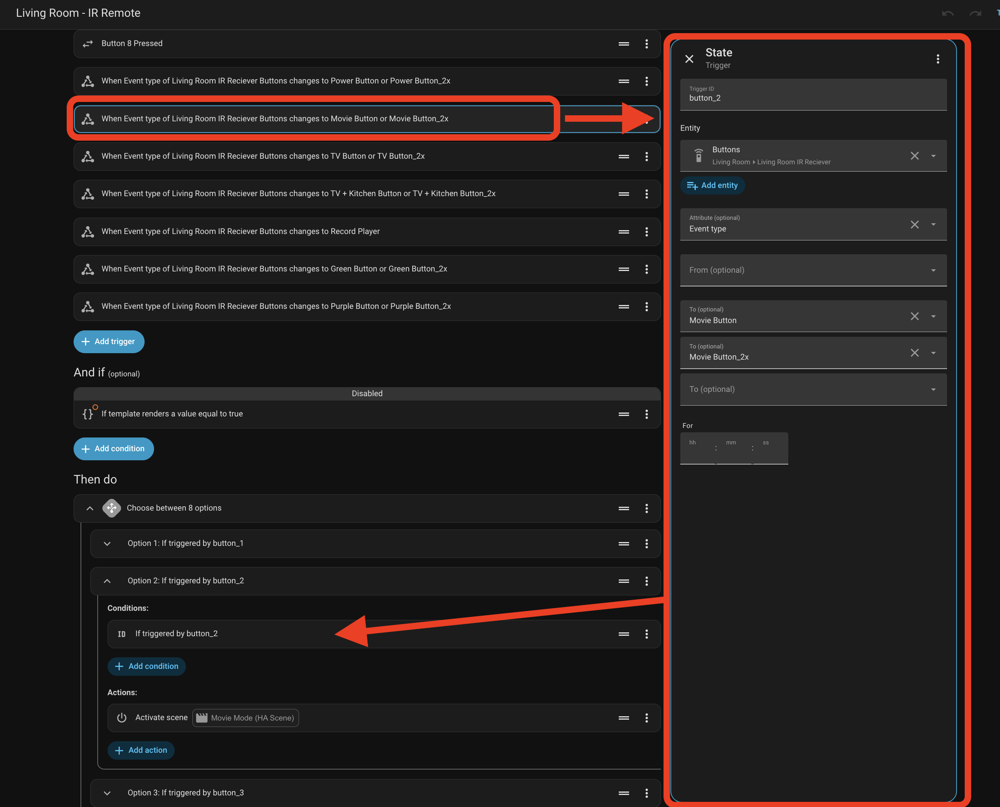

# dhruvb14 custom HACS integrations

Custom Home Assistant integrations distributed via [HACS](https://hacs.xyz).

# Why I created

I've been using a SideClick remote attached to my Apple TV to trigger Hue light via scenes in Home Assistant for about a year now. The setup worked, but it was a mess — ESPHome flashed to an IR receiver, MQTT bridging signals into HA, and a pile of custom automation logic just to map button presses to scenes. Every time something broke I had to dig back into the whole stack.




## Integrations

| Integration | Description | HA Version |
|---|---|---|
| [IR Remote Buttons](#ir-remote-buttons-ir_remote) | Learn any IR remote and use its buttons as automation triggers | 2026.6.0+ |

---

## IR Remote Buttons (`ir_remote`)

Point any IR remote at an ESPHome (or other) infrared receiver. Learn buttons
one at a time through the UI. Each button press fires an **event entity** that
automations can trigger on — including double-click variants.

### Requirements

- Home Assistant **2026.6.0** or later (requires the new `infrared` entity platform)
- An infrared receiver adopted into HA as an `infrared.*` entity
  (ESPHome with `ir_rf_proxy`, Broadlink, or the `kitchen_sink` demo)
- HACS installed

### Installation via HACS

1. In HACS, go to **Integrations → ⋮ → Custom repositories**.
2. Add `https://github.com/dhruvb14/hacs` as category **Integration**.
3. Search for **IR Remote Buttons** and click **Download**.
4. Restart Home Assistant.
5. Go to **Settings → Devices & Services → Add Integration** and search for
   **IR Remote Buttons**.

### Configuration

1. **Add integration** — select your infrared receiver entity and give the
   remote a name (e.g. "Living room TV remote").
2. **Add buttons** — on the integration's device page, click **Add button**.
   Choose **Learn from remote** (press the button twice to confirm) or
   **Enter code manually** (paste a bit string from a known command map).
3. Repeat for each button you want to use in automations.

Each time you add a button the integration reloads so the event entity's
`event_types` list is updated.

### UI walkthrough

**Integration overview** — click **Add button** (top-right) to start learning a new button



**1. Choose how to add the button**



**2. Press the button on your remote** (learn flow)



**3. First press captured — confirm you're ready for the second press**



**4a. Both presses matched — name the button**



**4b. Signals didn't match — try again**



### Using in automations

The integration creates one **event** entity per configured receiver. Use it
as an automation trigger:

```yaml
trigger: state
entity_id:
  - event.living_room_ir_reciever_buttons
attribute: event_type
to:
  - Movie Button
  - Movie Button_2x
id: button_2
```

Or via the UI: **Add Trigger → State → Entity → Event entity → event_type equals `Movie Button`**.



### Options (timing tuning)

Open the integration's options to adjust timing windows to suit your hardware:

| Option | Default | Description |
|---|---|---|
| Debounce window | 0.25 s | Signals faster than this are treated as repeats |
| New-press gap | 0.50 s | Minimum gap before the same button counts as a new press |
| Double-click window | 2.0 s | Maximum gap between two presses to count as double-click |
| Learn timeout | 60 s | How long the "Add button" flow waits for a signal |
| Fire single press immediately | off | When off, single press waits for the double-click window before firing |

---

## ESPHome Firmware

See [`esphome/`](esphome/) for ready-to-flash configurations:

- [`ir-receiver-esp32.yaml`](esphome/ir-receiver-esp32.yaml) — **recommended**;
  uses the hardware RMT peripheral for accurate, jitter-free capture.
- [`ir-receiver-esp8266.yaml`](esphome/ir-receiver-esp8266.yaml) — bit-bang
  fallback; requires careful tuning (see below).

Both configs use `!secret` for all credentials. Copy
[`esphome/secrets.yaml.example`](esphome/secrets.yaml.example) to
`esphome/secrets.yaml` and fill in your values before flashing.

### ESPHome receiver tuning

Getting these three `remote_receiver` settings right is critical. Wrong values
cause intermittent or completely broken button programming — even if the hardware
is wired correctly and the integration is set up properly.

#### `idle` — end-of-frame detection

ESPHome uses `idle` to decide when an IR transmission is finished. Once it sees
no transitions for this long, it packages everything it received as one signal
and sends it to HA.

**Too short:** Long or non-standard codes (e.g. 33-bit protocols, or remotes
with slow trailing edges) get **split into multiple partial signals**. HA
receives incomplete frames that fingerprint inconsistently. In practice this
shows up as:

- The two-press confirmation during "Learn from remote" always mismatches — both
  presses are captured but produce different fingerprints because each capture
  gets a different fragment of the full code.
- Buttons that learn successfully still fire as `unknown` at runtime because the
  stored fingerprint never matches the live (also fragmented) signal.

**Too long:** Repeat frames from holding a button down get merged into the
initial frame, producing an oversized signal that fingerprints differently from
a clean single press.

**Recommended starting point:** `25ms` works for standard NEC remotes. For
non-standard or longer protocols, start at `40ms` and increase until the
captures are stable. The ESP8266 config in this repo uses `40ms` for this reason.

#### `buffer_size` — signal storage

ESPHome stores each received transmission in a ring buffer. Each timing value
takes 2 bytes, so the default `2kb` can hold ~1000 individual timing measurements,
which is enough for most standard protocols.

**Too small:** If a code is genuinely long, or if `idle` is too short and
causes rapid-fire partial signals, the buffer fills and ESPHome silently **drops
the oldest data**. You receive a truncated signal with no error or warning.
Truncated signals fingerprint differently on every capture, making reliable
programming impossible.

**Recommended:** `4kb` covers even long non-standard protocols with room to
spare. There's no meaningful downside to using a larger buffer.

#### `tolerance` — timing jitter acceptance

IR timing tolerance controls how much variation is accepted in each received
pulse width. On the **ESP32**, hardware RMT captures timings with microsecond
accuracy, so the default 25% tolerance is generous. On the **ESP8266**,
IR is received via bit-banging (software timing), which introduces ±15–20%
jitter just from normal CPU interrupt latency.

**Too tight (e.g. 25% on ESP8266):** Marginal signals fail to decode cleanly.
The same button press produces different raw fingerprints each time — the two
confirmation presses during learning mismatch, and programming becomes a
frustrating game of retries.

**Too loose (e.g. 45%+):** On remotes with closely-spaced codes (e.g. an 8-button
remote where most buttons share a long common prefix and differ by only 2–3 bits),
a wide tolerance can cause one button's signal to be accepted as another button's,
causing **misfires** — pressing button 3 occasionally registers as button 5.

**Recommended:**
- ESP32: leave at the default (25% or omit entirely).
- ESP8266: `35%` is a good balance — enough margin for bit-bang jitter without
  being so wide that similar adjacent codes start to bleed into each other.
  If you still see misfires between similar buttons at 35%, try 30%.

#### ESP8266 quick-reference

These are the settings that resolved intermittent programming failures on a real
8-button remote with 33-bit non-standard codes:

```yaml
remote_receiver:
  idle: 40ms          # was 25ms — short idle split long frames into fragments
  buffer_size: 4kb    # was 2kb  — larger buffer prevents silent truncation
  tolerance: 35%      # was 30%  — bit-bang jitter needs the extra headroom
```

If you're still having trouble after applying these, uncomment `dump: raw` in
the ESPHome config to log the raw timing values to the ESPHome console. Compare
two captures of the same button — if the timing lists are wildly different lengths,
`idle` is still too short. If the lengths match but individual values vary a lot,
`tolerance` may need to go higher.

---

## Testing

### Without hardware (recommended for development)

Enable the `kitchen_sink` integration in your HA dev instance
(`configuration.yaml`):

```yaml
kitchen_sink:
```

This registers a `DemoInfraredReceiver` as `infrared.demo_ir_receiver`. Point
the config flow at it, then drive signals in the HA developer console:

```python
# Developer Tools → Template (or a script) — fire a fake signal
hass.components.infrared._handle_received_signal(
    "infrared.demo_ir_receiver",
    InfraredReceivedSignal(timings=[9000, -4500, 560, -1690, 560, -560, 560])
)
```

### Unit tests (no HA required)

The `ClickEngine` and `fingerprint()` function can be tested without any HA
machinery:

```bash
pip install pytest
pytest tests/components/ir_remote/test_engine.py -v
```

Tests cover:

- `fingerprint()` — NEC decode path, raw space-width quantization, edge cases
- `ClickEngine` (immediate mode) — first press, debounce, second-press-after-window,
  double-click detection, boundary conditions
- `ClickEngine` (delayed mode) — returns `None` on first press, fires `_2x` immediately

### Integration tests (requires HA test framework)

Follow the standard HA custom component test setup — mock the `infrared`
component using the patterns from `tests/components/infrared/common.py` and
`tests/components/lg_infrared/` in the HA core repo.
